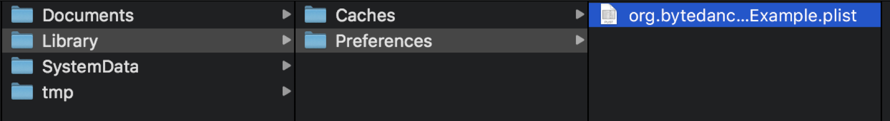
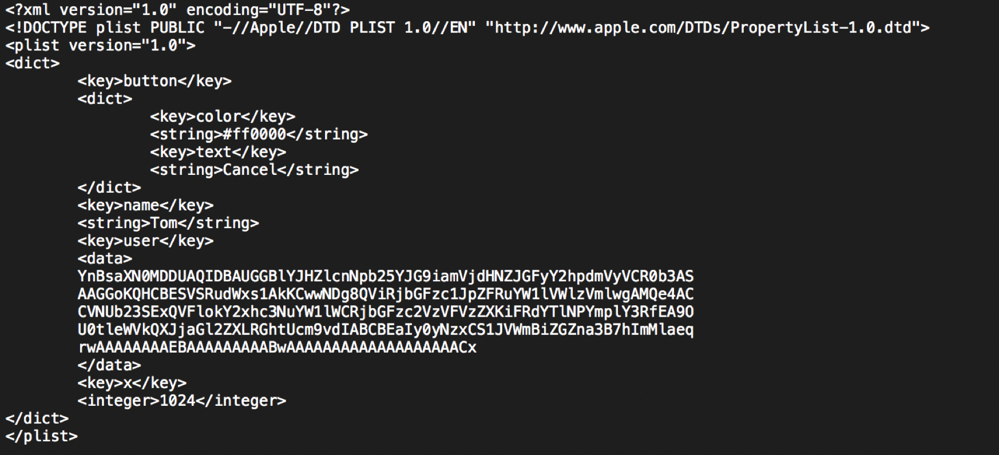

## 网络编程

### NSURLSession

<!--more-->

#### 发起一个Get请求

- 构建Request对象。
- 创建Session。
- 创建NSURLSessionDataTask。
- 执行Task
- Response处理。

```objc
-(void) sendHTTPPost
{
    NSURLSessionConfiguration *defaultConfigObject = [NSURLSessionConfiguration defaultSessionConfiguration];
    NSURLSession *delegateFreeSession = [NSURLSession sessionWithConfiguration: defaultConfigObject delegate: self delegateQueue: [NSOperationQueue mainQueue]];

    NSURL * url = [NSURL URLWithString:@"http://127.0.0.1:18081/edit"];
    NSMutableURLRequest * urlRequest = [NSMutableURLRequest requestWithURL:url];
    NSString * params =@"id=1&name=Test&age=50";
    [urlRequest setHTTPMethod:@"POST"];
    [urlRequest setHTTPBody:[params dataUsingEncoding:NSUTF8StringEncoding]];

    NSURLSessionDataTask * dataTask = [delegateFreeSession dataTaskWithRequest:urlRequest];
    [dataTask resume];
    
}
```

#### 发起一个Post请求

- 构建可变的Request对象。
- 设置请求方法为POST，设置请求体数据。
- 创建Session。
- 创建NSURLSessionDataTask。
- 执行Task
- Response处理。

```objc
-(void) httpPostWithCustomDelegate
{
    NSURLSessionConfiguration *defaultConfigObject = [NSURLSessionConfiguration defaultSessionConfiguration];
    NSURLSession *delegateFreeSession = [NSURLSession sessionWithConfiguration: defaultConfigObject
                                                                      delegate: nil delegateQueue: [NSOperationQueue mainQueue]];
    
    
    NSURL * url = [NSURL URLWithString:@"http://127.0.0.1:18081/edit"];
    NSMutableURLRequest * urlRequest = [NSMutableURLRequest requestWithURL:url];
    [urlRequest setHTTPMethod:@"POST"];
    NSString * params =@"id=1&name=Test2&age=30";
    [urlRequest setHTTPBody:[params dataUsingEncoding:NSUTF8StringEncoding]];
    
    
    NSURLSessionDataTask * dataTask =[delegateFreeSession dataTaskWithRequest:urlRequest
                                        completionHandler:^(NSData *data, NSURLResponse *response, NSError *error) {
                                          NSLog(@"Response:%@ %@\n", response, error);
                                          if(error == nil) {
                                              NSString * text = [[NSString alloc] initWithData: data encoding: NSUTF8StringEncoding];
                                              NSDictionary *dict = [NSJSONSerialization JSONObjectWithData:data options:0 error:nil];
                                              NSLog(@"Data = %@",text);
                                          }
                                      }];
    [dataTask resume];

}
```

#### 下载文件

- 构建Request对象。
- 创建Session。
- 创建NSURLSessionDownloadTask。
- 执行Task
- Response处理。

```objc
-(void)downloadFile
{
    NSURL * url = [NSURL URLWithString:@"http://127.0.0.1:18081/download/test.txt"];
    NSURLSessionConfiguration *defaultConfigObject = [NSURLSessionConfiguration defaultSessionConfiguration];
    NSURLSession *defaultSession = [NSURLSession sessionWithConfiguration: defaultConfigObject
                                                                 delegate:self
                                                            delegateQueue: [NSOperationQueue mainQueue]];

    NSURLSessionDownloadTask * downloadTask =[ defaultSession downloadTaskWithURL:url
                                                                completionHandler:^(NSURL *location, NSURLResponse *response, NSError *error)
                                              {
                                                  if(error == nil)
                                                  {
                                                      NSLog(@"Temporary file =%@",location);

                                                      NSError *err = nil;
                                                      NSFileManager *fileManager = [NSFileManager defaultManager];
                                                      NSString *docsDir = [NSSearchPathForDirectoriesInDomains(NSDocumentDirectory, NSUserDomainMask, YES) objectAtIndex:0];


                                                      NSURL *docsDirURL = [NSURL fileURLWithPath:[docsDir stringByAppendingPathComponent:@"out.zip"]];
                                                      if ([fileManager moveItemAtURL:location
                                                                               toURL:docsDirURL
                                                                               error: &err])
                                                      {
                                                          NSLog(@"File is saved to =%@",docsDir);
                                                      }
                                                      else
                                                      {
                                                          NSLog(@"failed to move: %@",[err userInfo]);
                                                      }
                                                  }
                                              }];
    [downloadTask resume];
}
```


### 第三方框架AFNetWorking

- AFNetWorking一款轻量级网络请求开源框架，基于Cocoa扩展的高层网络抽象，使用模块化的架构，具有设计良好、功能丰富的API。降低了iOS开发工程师处理网络请求的难度，让iOS开发变成一件愉快的事情。
- GitHub地址：https://github.com/AFNetworking/AFNetworking

## 本地存储

### **iOS** 沙盒

每一个App都有一个存储空间。iOS系统为每个应用程序创建自己的目录，每个应用程序只能访问自己的目录，不能相互通信。

#### 沙盒目录

- Documents：保存应用运行时生成的需要持久化的数据,iTunes会自动备份该目录。苹果建议将在应用程序中浏览到的文件数据保存在该目录下。

- Library:

- - Caches：一般存储的是缓存文件，例如图片视频等，此目录下的文件不会再应用程序退出时删除。在手机备份的时候，iTunes不会备份该目录。例如音频,视频等文件存放其中
  - Preferences：保存应用程序的所有偏好设置iOS的Settings(设置)，我们不应该直接在这里创建文件，而是需要通过NSUserDefault这个类来访问应用程序的偏好设置。iTunes会自动备份该文件目录下的内容。比如说:是否允许访问图片,是否允许访问地理位置......

- tmp：临时文件目录，在程序重新运行的时候，和开机的时候，会清空tmp文件夹。

#### 获取沙盒目录

```objc
// 获取document目录
    NSArray *documentPaths = NSSearchPathForDirectoriesInDomains(NSDocumentDirectory, NSUserDomainMask, YES);
    NSString *documentPath = [documentPaths objectAtIndex:0];

    // 获取Cache目录
    NSArray *cachePaths = NSSearchPathForDirectoriesInDomains(NSCachesDirectory, NSUserDomainMask, YES);
    NSString *cachePath = [cachePaths objectAtIndex:0];

    // 获取Library目录
    NSArray *libraryPaths = NSSearchPathForDirectoriesInDomains(NSLibraryDirectory, NSUserDomainMask, YES);
    NSString *libraryPath = [libraryPaths objectAtIndex:0];

    // 获取Tmp目录
    NSString *tmpPath = NSTemporaryDirectory();
```

#### 文件及文件夹操作

```objc
// 判断文件是否存在
    NSFileManager *fileManager = [NSFileManager defaultManager];

    NSString *document = NSSearchPathForDirectoriesInDomains(NSDocumentDirectory, NSUserDomainMask, YES).firstObject;
    NSString *filePath = [document stringByAppendingPathComponent:@"test.txt"];

    if ([fileManager fileExistsAtPath:filePath]) {
        NSLog(@"test.txt exists");
    }

    BOOL isDirectory;
    if ([fileManager fileExistsAtPath:filePath isDirectory:&isDirectory]) {

    }

    // 创建目录
    NSString *testDir = [document stringByAppendingPathComponent:@"test"];

    NSError *error;

    [fileManager createDirectoryAtPath:testDir withIntermediateDirectories:YES attributes:nil error:&error];

    // 创建文件
    NSString *testTxt = [testDir stringByAppendingPathComponent:@"test.txt"];
    NSData *data = [@"Hello world!" dataUsingEncoding:NSUTF8StringEncoding];
    [fileManager createFileAtPath:testTxt contents:data attributes:nil];

    // 删除文件
    [fileManager removeItemAtPath:testTxt error:nil];
```

#### 文件读写

```objc
- (IBAction)write:(id)sender {
    NSString *document = NSSearchPathForDirectoriesInDomains(NSDocumentDirectory, NSUserDomainMask, YES).firstObject;

    NSString *filePath = [document stringByAppendingPathComponent:@"text.txt"];

    NSString *contents = @"Hello world!";
    [contents writeToFile:filePath atomically:YES encoding:NSUTF8StringEncoding error:nil];
}

- (IBAction)read:(id)sender {
    NSString *document = NSSearchPathForDirectoriesInDomains(NSDocumentDirectory, NSUserDomainMask, YES).firstObject;

    NSString *filePath = [document stringByAppendingPathComponent:@"text.txt"];

    NSString *content = [NSString stringWithContentsOfFile:filePath encoding:NSUTF8StringEncoding error:nil];
    NSLog(@"content %@", content);
}
```


### **NSUserDefaults**

- NSUserDefaults用来存储 用户设置 系统配置等一些小的数据。
   因为数据是明文存储在 plist 文件中，不安全，即使只是修改一个 key 都会 load 整个文件，数据多加载慢(IO 内存)，不适合存储大量数据。
   它是单例的，也是线程安全的，是以键值对 key-value 的形式保存在沙盒中
   存储路径为：沙盒路径的Library——>Preferences文件夹中

- 支持的数据类型有NSString、 NSNumber、NSDate、 NSArray、NSDictionary、BOOL、NSInteger、NSFloat等系统定义的数据类型，如果要存放其他数据类型或者自定义的对象（如自定义的类对象），则必须将其转换成NSData存储。

- - 即使对象是NSArray或NSDictionary，他们存储的类型也应该是以上范围包括的。

```objc
// save
    [[NSUserDefaults standardUserDefaults] setInteger:1024 forKey:@"x"];
    [[NSUserDefaults standardUserDefaults] setObject:@"Tom" forKey:@"name"];
    [[NSUserDefaults standardUserDefaults] setObject:@{
                                                       @"text": @"Cancel",
                                                       @"color": @"#ff0000",
                                                       } forKey:@"button"];
    User *user = [[User alloc] init];
    user.userId = 123;
    user.nickname = @"Tom";
    user.isVip = YES;

    NSData *data = [NSKeyedArchiver archivedDataWithRootObject:user requiringSecureCoding:YES error:nil];
    [[NSUserDefaults standardUserDefaults] setObject:data forKey:@"user"];

    // read
    NSInteger x = [[NSUserDefaults standardUserDefaults] integerForKey:@"x"];
    NSString *name = [[NSUserDefaults standardUserDefaults] stringForKey:@"name"];
    NSDictionary *dict = [[NSUserDefaults standardUserDefaults] objectForKey:@"button"];
    data = [[NSUserDefaults standardUserDefaults] dataForKey:@"user"];
    user = [NSKeyedUnarchiver unarchivedObjectOfClass:[User class] fromData:data error:nil];
```

 

 

