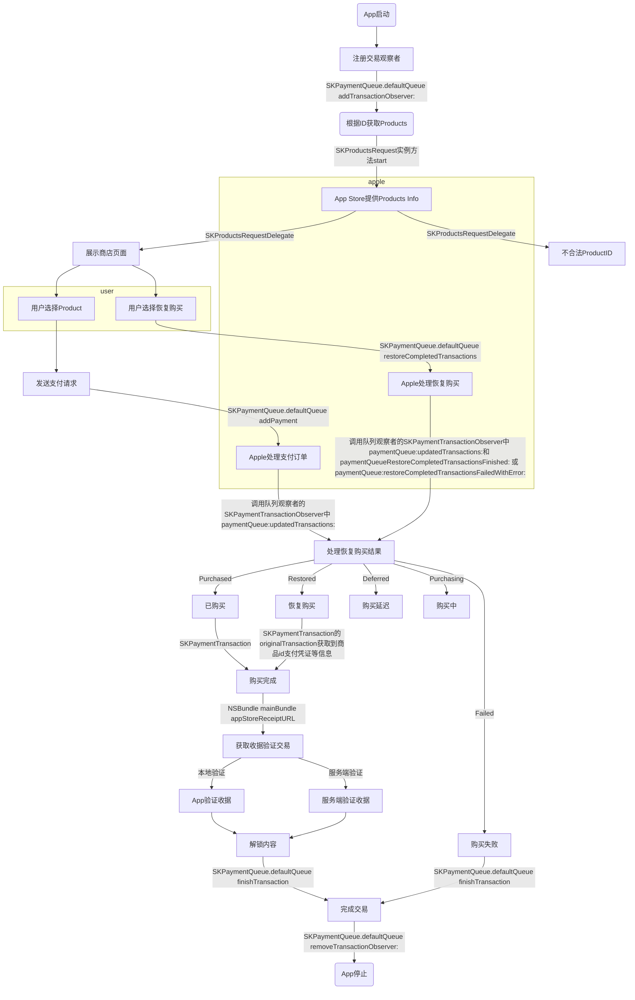

## 内购类型

- 消耗型项目
- 非消耗性项目
- 自动续期订阅
- 非自动续期订阅

|             | 消耗型项目 | 非消耗型项目 | 自动续期订阅 | 非自动续期订阅 |
| ----------- | ---------- | ------------ | ------------ | -------------- |
| 可以Restore | 否         | 是           | 是           | 否             |
| 有时间限制  | 否         | 否           | 是           | 是             |
|             |            |              |              |                |

## 收据验证

On-device validation
Server-side validation
Validates authenticity of receipt
Yes
Yes
Includes renewal transactions
Yes
Yes
Includes additional user subscription information
No
Yes
Handles renewals without client dependency
No
Yes
Resistant to device clock change
No
Yes

## 交易流程图

